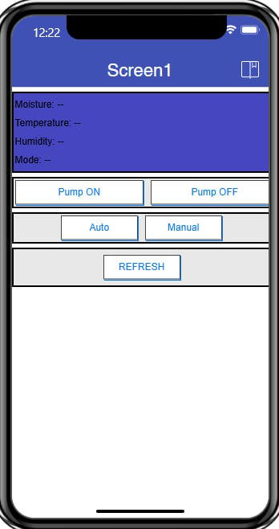
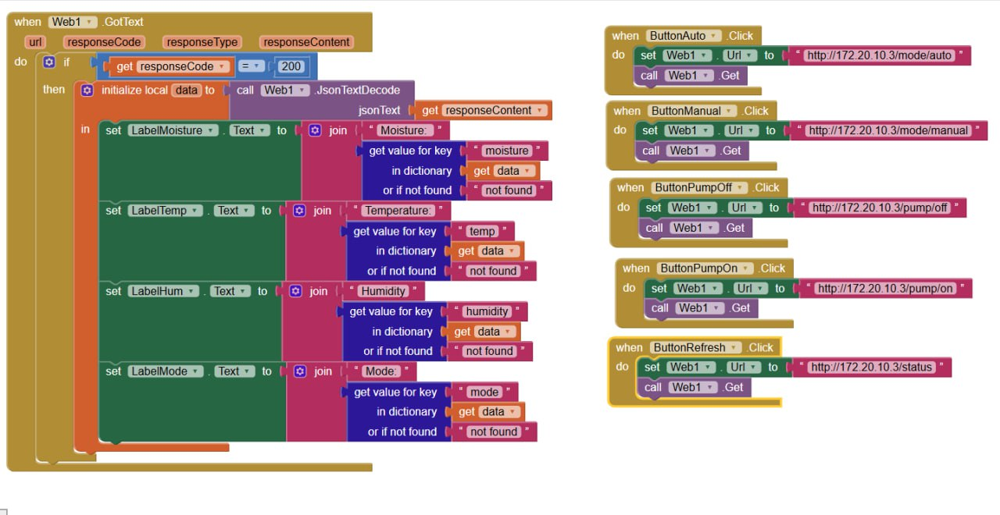

# Smart Plant Monitor (ESP32, MicroPython, Telegram, MIT App)

This is a final IoT project that automatically waters a plant based on soil moisture
and allows **manual control** using a **MIT App Inventor mobile app**.
The system runs entirely on **MicroPython (Thonny)** using an **ESP32**.

It supports:

- **Automatic watering** (Auto Mode): ESP32 decides when to water.
- **Manual watering** (Manual Mode): You control the pump from a **mobile app**.
- **Telegram alerts** and status messages.
- **HTTP API** so the app can read sensor data and control the pump.

---

## Main Features

- Read **Soil Moisture**, **Temperature**, and **Humidity**
- **Auto watering** when soil is too dry
- **Manual watering** via MIT App Inventor
- **Relay-controlled water pump**
- **Telegram notifications**:
  - Soil too dry / pump ON
  - Soil back to normal / pump OFF
    
  - Periodic status :
    - Soil moisture (ADC raw values)
    - Temperature (°C)
    - Humidity (%)

- **ESP32 Web Server**:
  - `GET /pump/on` – Turn pump ON
  - `GET /pump/off` – Turn pump OFF
  - `GET /status` – Get latest sensor data (JSON or text)

---

## Hardware Components

| Component              | Description                             |
|------------------------|-----------------------------------------|
| ESP32                  | Main Wi-Fi microcontroller              |
| Soil Moisture Sensor   | Reads moisture level in the soil        |
| DHT22                  | Reads temperature & humidity            |
| Relay Module           | Switches pump ON/OFF                    |
| Water Pump             | Waters the plant                        |
| External 5V/USB Supply | Powers the pump                         |
| Jumper Wires / Breadboard | Wiring and prototyping               |
| Android Phone          | Runs MIT App Inventor app               |


## Wiring Diagram 


---

## System Overview

### 1. System Architecture

```text
Sensors (Soil + DHT22)
        ↓
     ESP32
        ↓
Relay → Water Pump
```

### 2. Telegram Alert Flow

```text
ESP32 (Wi-Fi) → Telegram Bot API → Your Telegram Chat
```

### 3. Manual Control Flow

```text
MIT App → HTTP (Wi-Fi) → ESP32 Web Server → Pump + Status
```

- The app and browser send HTTP requests like:
  
```text
http://<ESP32_IP>/pump/on
http://<ESP32_IP>/pump/off
http://<ESP32_IP>/mode/auto
http://<ESP32_IP>/mode/manual
http://<ESP32_IP>/status
```

- Example call:
  
```text
http://<ESP_IP>/pump/on
```

- Status returns JSON:
  
```json
  "moisture": 2500,
  "temp": 28.5,
  "humidity": 70.2,
  "pump": false,
  "mode": "AUTO"
```

### 4. Auto Watering Mode

In **Auto Mode**, the ESP32 (MicroPython script):

- Reads soil moisture (analog value) in a loop with a delay.
- Compares it against a threshold, for example:

```python
SOIL_DRY_THRESHOLD = 2500
CONTROL_MODE = "AUTO"

---
---

if CONTROL_MODE == "AUTO":
    if soil >= SOIL_DRY_THRESHOLD and not last_status["pump"]:
        set_pump(True)
        send_telegram_message(...)

    elif soil < SOIL_DRY_THRESHOLD and last_status["pump"]:
        set_pump(False)
        send_telegram_message(...)
```

### 5. MIT App Inventor
#### UI Recommended Setup
##### Labels:
- Soil Moisture
- Temperature
- Humidity
- Pump Status
- Mode

##### Buttons:
- Refresh
- Pump ON
- Pump OFF
- Auto Mode
- Manual Mode

# MIT App Inventor
## Mobile App


## End Point


# Future Improvements
- OLED display
- Water level sensor
- Cloud dashboard (Grafana)
- More plants

# Conclusion
This project successfully demonstrates a complete IoT automation system:
- Auto watering
- Manual control
- HTTP API
- Telegram notifications
- ESP32 + MicroPython
- Industrial IoT concept
