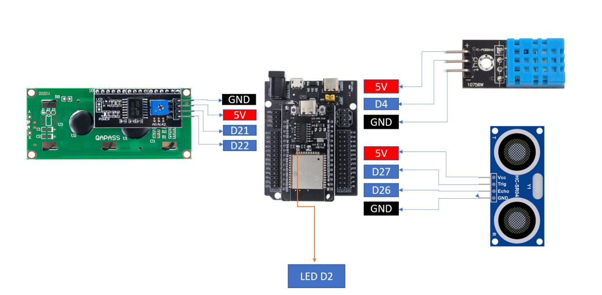
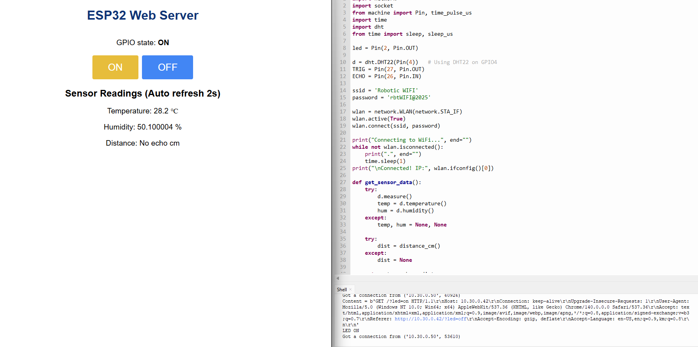
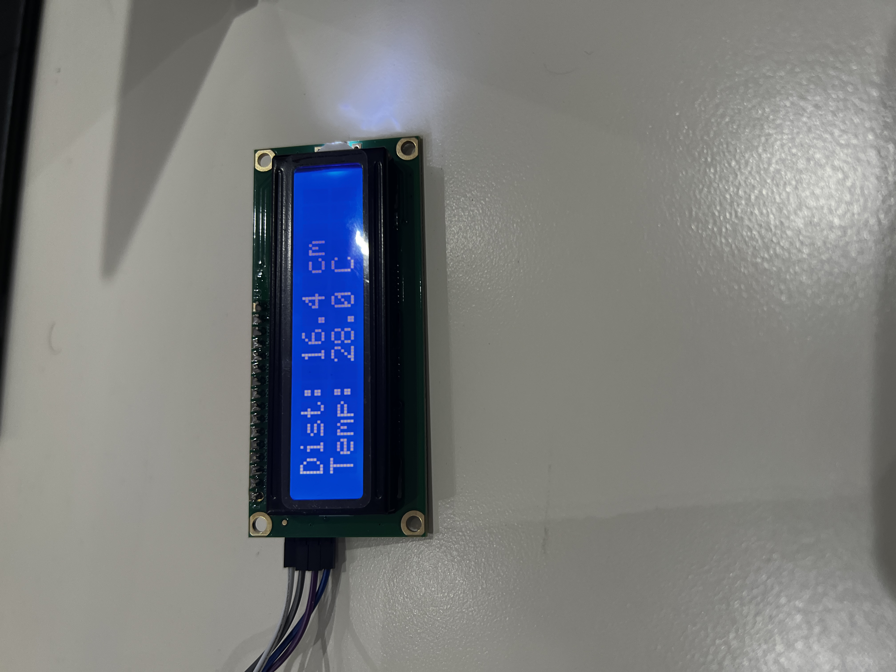

# IoT Webserver with LED, Sensors, and LCD Control

## Overview

This project implements an **ESP32-based IoT system using MicroPython**. The device hosts a webserver that allows users to:

* Control an LED via web buttons.
* Read **temperature (DHT11)** and **distance (HC-SR04 ultrasonic)** sensors.
* Display sensor values and custom text on an **I²C LCD display**.
* Interact with hardware through a simple browser interface.

The lab emphasizes **web–hardware interaction** and **event-driven IoT design**.

---

## Equipment

* ESP32 Development Board (with MicroPython firmware)
* DHT11 Temperature/Humidity Sensor
* HC-SR04 Ultrasonic Distance Sensor
* 16×2 LCD with I²C Backpack
* Breadboard, jumper wires
* USB cable and laptop (with Thonny IDE)
* Wi-Fi network

---

## Wiring Diagram

* **LED** → GPIO2 (with appropriate resistor)
* **DHT11** → GPIO4 (VCC to 3.3V, GND to GND)
* **HC-SR04**:

  * Trigger → GPIO5
  * Echo → GPIO18
  * VCC → 5V, GND → GND
* **LCD I²C** → SDA (GPIO21), SCL (GPIO22), VCC (3.3V), GND


---

## Setup Instructions

1. Flash ESP32 with MicroPython firmware.
2. Connect ESP32 via USB and open **Thonny IDE**.
3. Upload project files:

   * `main.py`
   * `lcd_api.py`
   * `i2c_lcd.py`
4. Update Wi-Fi credentials in `main.py`:

   ```python
   SSID = "YourWiFiName"
   PASSWORD = "YourWiFiPassword"
   ```
5. Run `main.py`. The ESP32 will connect to Wi-Fi and start the webserver.
6. Note the ESP32’s IP address (shown in Thonny console).

---

## Usage Instructions

1. Open a browser and enter ESP32’s IP (e.g., `http://192.168.x.x`).
2. **LED Control**

   * Click **ON** or **OFF** to control the LED on GPIO2.
3. **Sensor Readings**

   * Temperature and distance values refresh every 1–2 seconds.
4. **Sensor → LCD**

   * Click **Show Distance** → Displays distance on LCD line 1.
   * Click **Show Temp** → Displays temperature on LCD line 2.
5. **Custom Text → LCD**

   * Enter text in the textbox → Click **Send** → Text appears on LCD.
   * If >16 chars, text scrolls across the screen.

---

## Output of the code and demonstration
---

### Task 1
[Click here to see the demonstration of Task 1](https://www.youtube.com/shorts/zoASdev9bng)

---

### Task 2


---

### Task 3


---

### Task 4
[Click here to see the demonstration of Task 4](https://www.youtube.com/shorts/WLqWbdPNkzw)

---


