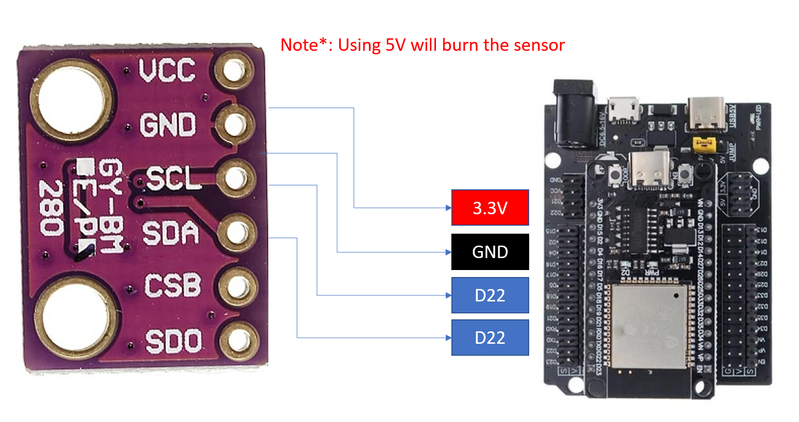

# IoT Atmospheric Sensor using BMP280 and ESP32

## Project Overview

In this lab, I built a small IoT environmental monitoring system using an **ESP32** and a **BMP280** sensor. 
The BMP280 measures **temperature**, **pressure**, and **altitude**, and the ESP32 reads these values and displays them through the serial monitor. This system send the sensor data to the cloud and display dashboard in real time. The goal of this project is to understand how sensors communicate with microcontrollers using the **I²C interface**, and how to collect and process environmental data accurately.

---

## What I Learned

- How to interface the **BMP280** sensor with an **ESP32** using MicroPython.  
- How to read **temperature**, **pressure**, and **altitude** data from the sensor.  
- Understanding how the **I²C communication protocol** works.  
- How to use **Thonny IDE** to program and upload code to ESP32.  
- How to calculate **altitude** using pressure data.  
- How to integrate IoT devices using **MQTT protocol** for efficient cloud communication.  
- How to connect the ESP32 to **ThingsBoard Cloud** to visualize live telemetry data and build IoT dashboards.  
- How this sensor can be applied to real-world IoT applications such as **weather stations** or **drone height tracking**.

---

## What You’ll Need

- ESP32 Dev Board (flashed with MicroPython)  
- BMP280 Sensor Module  
- Jumper Wires  
- USB Cable + Laptop with **Thonny IDE**  
- Wi-Fi connection (optional if extending to IoT cloud logging)

---

## Wiring Setup

ESP32 → BMP280 connections:

| ESP32 Pin | BMP280 Pin | Purpose |
|------------|-------------|----------|
| 3V3 | VCC | Power supply |
| GND | GND | Ground |
| GPIO22 | SCL | I²C clock line |
| GPIO21 | SDA | I²C data line |

---

## Wiring Diagram


Example connection:  
`ESP32 GPIO22 → BMP280 SCL`  
`ESP32 GPIO21 → BMP280 SDA`

---

## Setup & Configuration

1. Flash your ESP32 with **MicroPython** firmware.  
2. Open **Thonny IDE** and connect to your ESP32 board.  
3. Upload the `bmp280.py` driver file to your ESP32.  
4. Create and save the code as `main.py`:
   Open the `main.py` file and update the following configuration variables with your own details:

    ```python
    # WiFi Credentials
    WIFI_SSID = 'Your_WiFi_Name'
    WIFI_PASSWORD = 'Your_WiFi_Password'
   # MQTT setup 
    MQTT_BROKER = "test.mosquitto.org"   # public test broker
    MQTT_PORT   = 1883                   # default MQTT port
    CLIENT_ID   = b"Your ID"
    TOPIC       = b"Your Topic"     # your custom topic
    
---

## How It Works
1. The ESP32 initializes communication with the BMP280 sensor over the I²C protocol.
2. The BMP280 measures the barometric pressure and temperature of the environment.
3. Using these readings, it estimates altitude based on the barometric formula.
4. Random values (10–20) every 5 seconds.
5. Those datas publish to ThingsBoard dashboards via **MQTT**.

---

## MQTT

---

## ThingsBoard 


