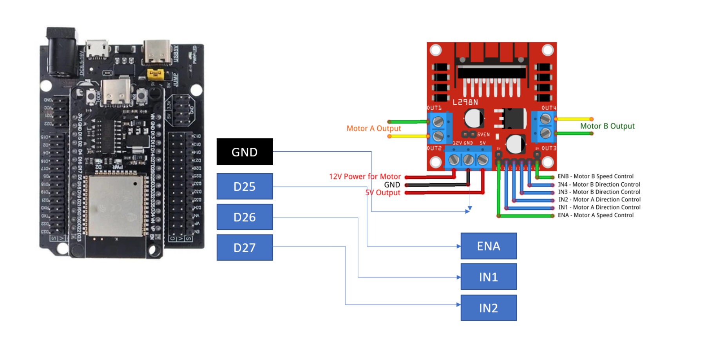
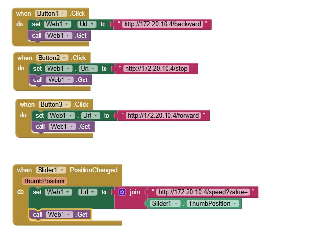
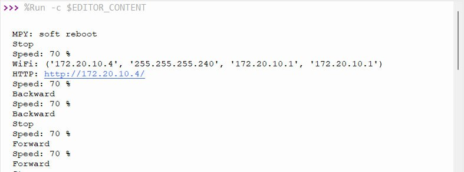
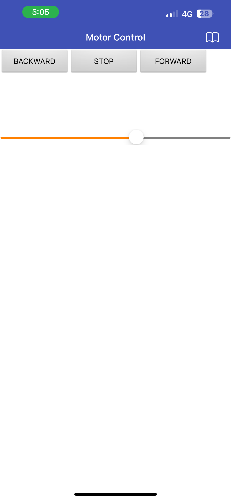
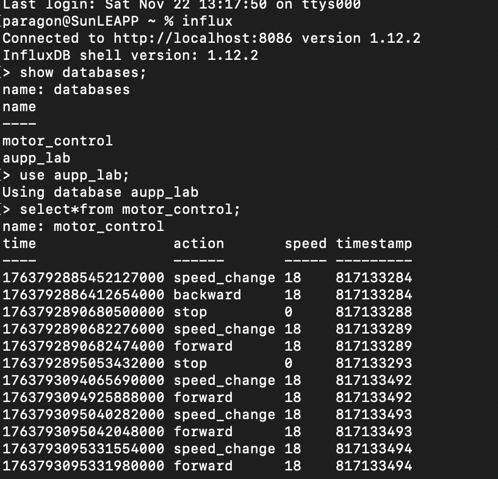
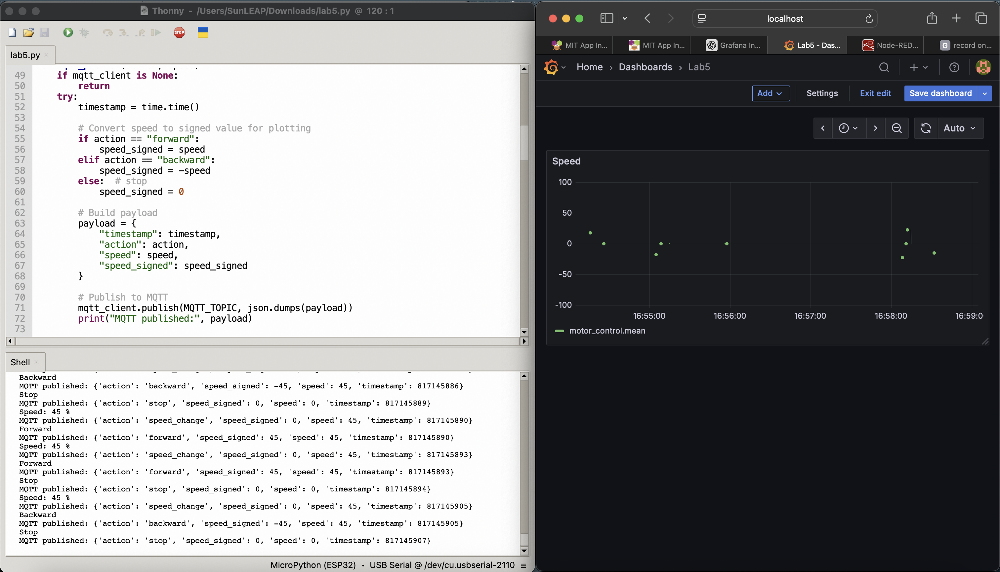

# LAB 5 – IoT DC Motor Control using ESP32, Mobile App, MQTT, Node-RED, InfluxDB & Grafana

## 1. Project Overview
This project implements an IoT-based DC motor control system using an **ESP32** microcontroller.

A custom **mobile app (MIT App Inventor)** sends commands to the ESP32 over Wi-Fi.  
The ESP32 controls a DC motor via an **L298N driver**, and logs motor actions to **MQTT**, which are processed by **Node-RED** and stored in **InfluxDB**. A **Grafana dashboard** visualizes the motor’s activity in real-time.

Path: ESP32 → MQTT → Node-RED → InfluxDB → Grafana

The system supports:

- Forward / Backward motor control  
- Stop function  
- Speed control via PWM  
- Dashboard visualization in Grafana  
- Wi-Fi auto-reconnect   
- Graceful HTTP error handling 

---

## 2. Hardware Components

- ESP32 Dev Board (MicroPython)
- L298N Motor Driver
- DC Motor
- External Power Supply (7–12 V) for motor
- Android phone (MIT App)
- PC/Laptop running Node-RED, InfluxDB, Grafana

---

## 3. Wiring Diagram

### 3.1 ESP32 → L298N Connections

| ESP32 Pin | L298N Pin | Description           |
|----------:|-----------|-----------------------|
| GPIO 25   | ENA       | PWM Speed Control     |
| GPIO 26   | IN1       | Motor Direction 1     |
| GPIO 27   | IN2       | Motor Direction 2     |
| GND       | GND       | Common Ground         |

### 3.2 Motor Power

- `+12V` of L298N connected to external motor supply (e.g. 9–12 V)
- `GND` of motor supply is shared with ESP32 GND

## 4 HTTP Endpoints

The ESP32 exposes several HTTP endpoints used by the mobile app:

- `/` — Main web UI page
- `/forward` — Moves the motor forward
- `/backward` — Moves the motor backward
- `/stop` — Stops the motor
- `/speed?value=N` — Sets motor speed (0–100%)

The HTTP server:

- Parses request lines safely
- Ignores malformed or empty HTTP requests
- Prints errors but **continues running**
- Prevents crashes 

---

## 4.3 PWM Motor Control

The DC motor is controlled using PWM and two direction pins:

- **GPIO 25 → ENA** (PWM speed control)
- **GPIO 26 → IN1** (direction)
- **GPIO 27 → IN2** (direction)

Speed control:

- Slider value (0–100) is converted into PWM duty cycle
- Duty cycle range depends on MicroPython version  
  (0–1023 or 0–65535)

---

# 5. MQTT Logging

The ESP32 logs every motor action using MQTT with the following configuration:

- **Broker:** `test.mosquitto.org`
- **Port:** `1883`
- **Topic:** `lab5/motor/logs`

MQTT is used to send structured telemetry for Node-RED and InfluxDB.

##JSON Payload Example

```json
{
  "timestamp": 1730000000,
  "action": "forward",
  "speed": 70,
  "speed_signed": 70
}
```

## 6. Node-RED Flow

MQTT In Node:
- Server: `test.mosquitto.org:1883`
- Topic: `lab5/motor/logs`

JSON Node:
- Converts MQTT text payload into a JSON object

Function / Change Node:
- Maps fields to InfluxDB measurement format

InfluxDB Out Node:
- Bucket: `motor_control`
- Measurement: `motor_events`
- Fields: `speed`, `speed_signed`
- Tags: `action`
  
## 7. Grafana Dashboard Setup

Grafana visualizes motor actions stored in InfluxDB.

---

## Data Source

Steps:

- Go to: **Configuration → Data Sources**
- Select: **InfluxDB**
- Configure the following:

  - **URL:** your InfluxDB URL  
  - **Organization:** your organization name  
  - **Bucket:** `motor_control`  
  - **Token:** your InfluxDB API token  


## Task 1
- Endpoints:



- Serial Output Showing Commands: 
  


## Task 2
- MIT App Inventor:

<!-- Basic HTML image with width -->


- Demonstration Video:

[](https://www.youtube.com/watch?v=o0OIUnWIQK4)

## Task 3
- Terminal Log and InfluxDB Data Preview:

<!-- Basic HTML image with width -->


## Task 4
- Grafana Dashboard Updating in Real Time:

<!-- Basic HTML image with width -->


## Demostration


